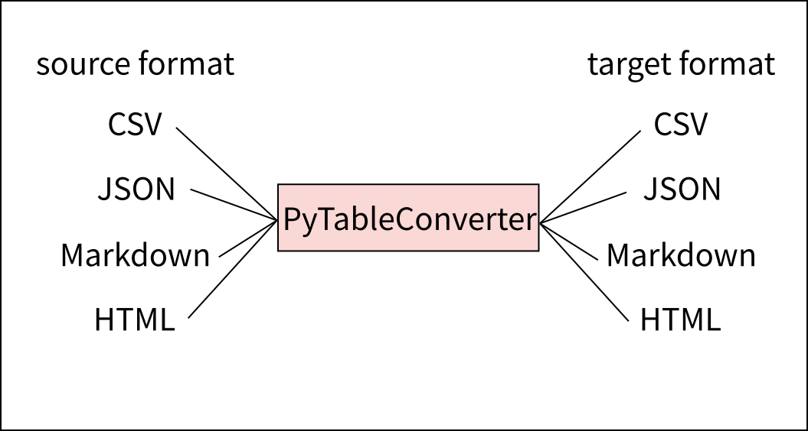
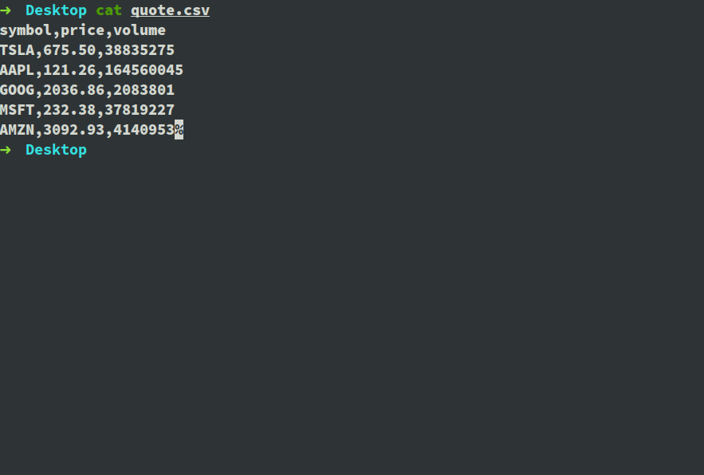
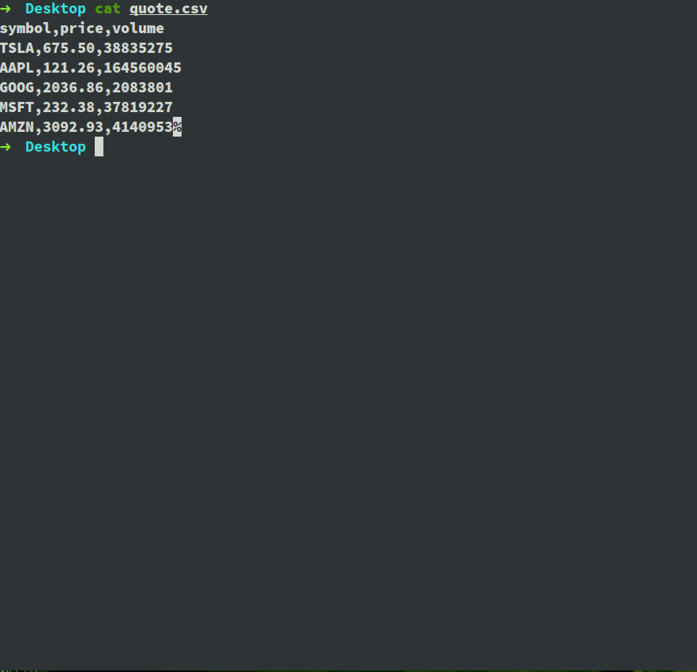
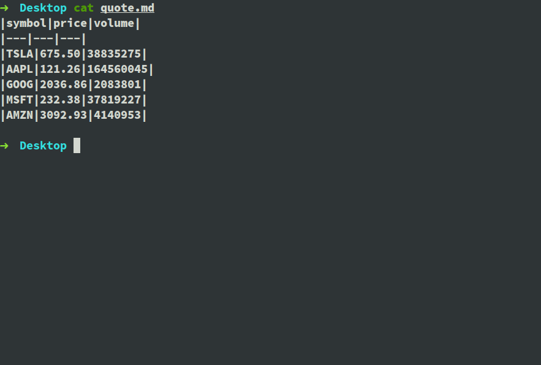
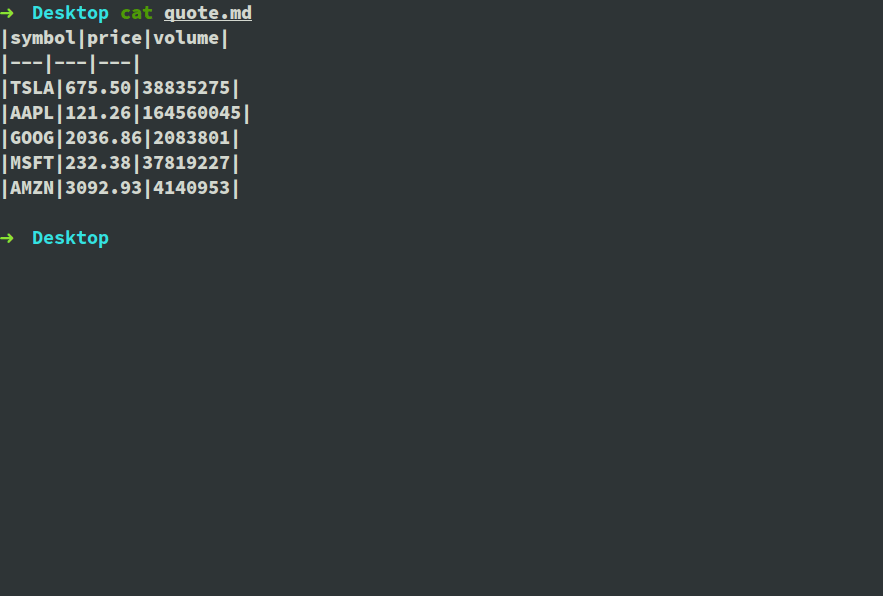

# PyTableConverter


A command line tool to convert tables in various formats.

[](https://pypi.python.org/pypi/tableconverter)

## Examples

* CSV to Markdown



* CSV to JSON


* CSV to HTML



* Markdown to CSV



* Markdown to JSON



## Quick start

### Installation

```bash
pip install --upgrade tableconverter
```

### Basic usage

You can give the input file and the destination format, e.g.

```bash
tableconverter demos/assets/example.csv -d html
```

and the output will be

```html
<table>
  <tr>
    <th>col1</th>
    <th>col2</th>
    <th>col3</th>
  </tr>
  <tr>
    <td>aaaa</td>
    <td>bbbb</td>
    <td>cccc</td>
  </tr>
  <tr>
    <td>&excl;&commat;&num;&dollar;</td>
    <td>&percnt;&Hat;&amp;&ast;</td>
    <td>&lpar;&rpar;&lt;&gt;</td>
  </tr>
  <tr>
    <td>1111</td>
    <td>2222</td>
    <td>3333</td>
  </tr>
</table>
```

You can also give the output file, e.g.

```
tableconverter demos/assets/example.csv -d html -o example.html
```

and the output will be written to `example.html`.

If no input file is given, the command will expect the input from `stdin`. In this case, the source format `-s csv` **MUST** be given.

```bash
tableconverter -s csv -d html -o example.html
# input CSV here
# ends with <CTRL-D> on Unix or <CTRL-Z> on Windows
```

You can also so use the command with `Heredoc` and the output will be the same.
```bash
cat << EOF | tableconverter -s csv -d html > example.html
> col1,col2,col3
> aaaa,bbbb,cccc
> !@#$,%^&*,()<>
> 1111,2222,3333
> EOF
```


## Supported formats
* CSV
* Markdown
* HTML
* JSON

## Lisence
PyTableConverter is released under the terms of the MIT license.
